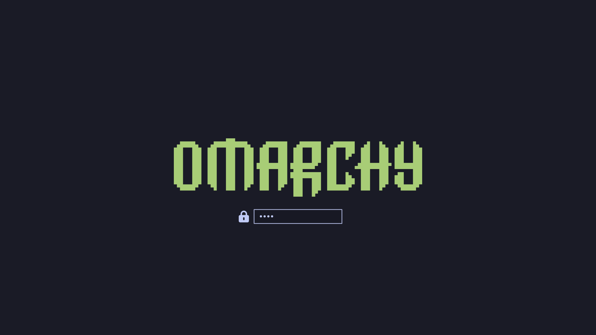

# 🚗 Quattro Plymouth Boot Theme

An eye-catching, futuristic boot splash theme for Linux featuring an Audi Quattro flying car animation, full-disk encryption (LUKS) password unlock UI, and a sleek dark aesthetic.

---

## 📹 Video Preview

https://github.com/user-attachments/assets/quattro-plymouth-demo

<p align="center">
  <video src="https://github.com/nightdevil00/quattro-plymouth/raw/main/video.mp4" width="100%" controls autoplay loop muted>
    Your browser does not support the video tag.
  </video>
</p>

> 🎬 *If the video doesn't play above, you can [view or download video.mp4 directly](./video.mp4).*

---

## 📸 Screenshots

### Disk Decryption / Password Prompt
<p align="center">
  
</p>

---

## ✨ Features

- **Smooth Flying Car Animation**: 146-frame sequence optimized and pre-loaded for fluid, glitch-free playback on boot.
- **LUKS Password Prompt Support**: Custom entry box, animated bullet indicators, and lock icon for full-disk encryption passphrases.
- **Seamless Transition**: Clean transition from password decryption to boot animation.
- **Tokyo Night Palette**: Refined dark background (`#1a1b26`) matching modern desktop setups.
- **Two Variants Included**:
  - `omarchy-anim`: Full animated flying car boot theme.
  - `omarchy`: Classic logo with an eased progress bar.

---

## 📦 Requirements

- **Linux** (Arch Linux, Ubuntu, Debian, Fedora, openSUSE, etc.)
- **Plymouth** (`plymouth` and `plymouth-x11` for testing)

---

## 🚀 Installation

### 1. Clone the Repository
```bash
git clone https://github.com/nightdevil00/quattro-plymouth.git
cd quattro-plymouth
```

### 2. Copy the Theme to Plymouth Directory
```bash
# Install 
sudo cp -r omarchy-anim /usr/share/plymouth/themes/


### 3. Set as Default Theme
```bash
sudo plymouth-set-default-theme -R omarchy-anim
```

### 4. Update Initramfs / Boot Image

Depending on your Linux distribution:

- **Arch Linux / Manjaro**:
  ```bash
  sudo mkinitcpio -P
  ```
  *(Ensure `plymouth` is added to the `HOOKS` array in `/etc/mkinitcpio.conf` after `base` and `udev`)*


## ⚙️ Customization

You can edit `/usr/share/plymouth/themes/omarchy-anim/omarchy-anim.script` to adjust:
- **Background Color**: Modify `Window.SetBackgroundTopColor` / `Window.SetBackgroundBottomColor`.
- **Font & Size**: Modify `MonospaceFont` and `Font` in `omarchy-anim.plymouth`.
- **Animation Speed / Framing**: Adjust frame rate logic in `refresh_callback()`.

DISCLAIMER : I've only tested on non-encrypted drive
---

## 📄 License

Distributed under the [MIT License](LICENSE) or GNU GPL. Feel free to modify and customize for your own setup!
